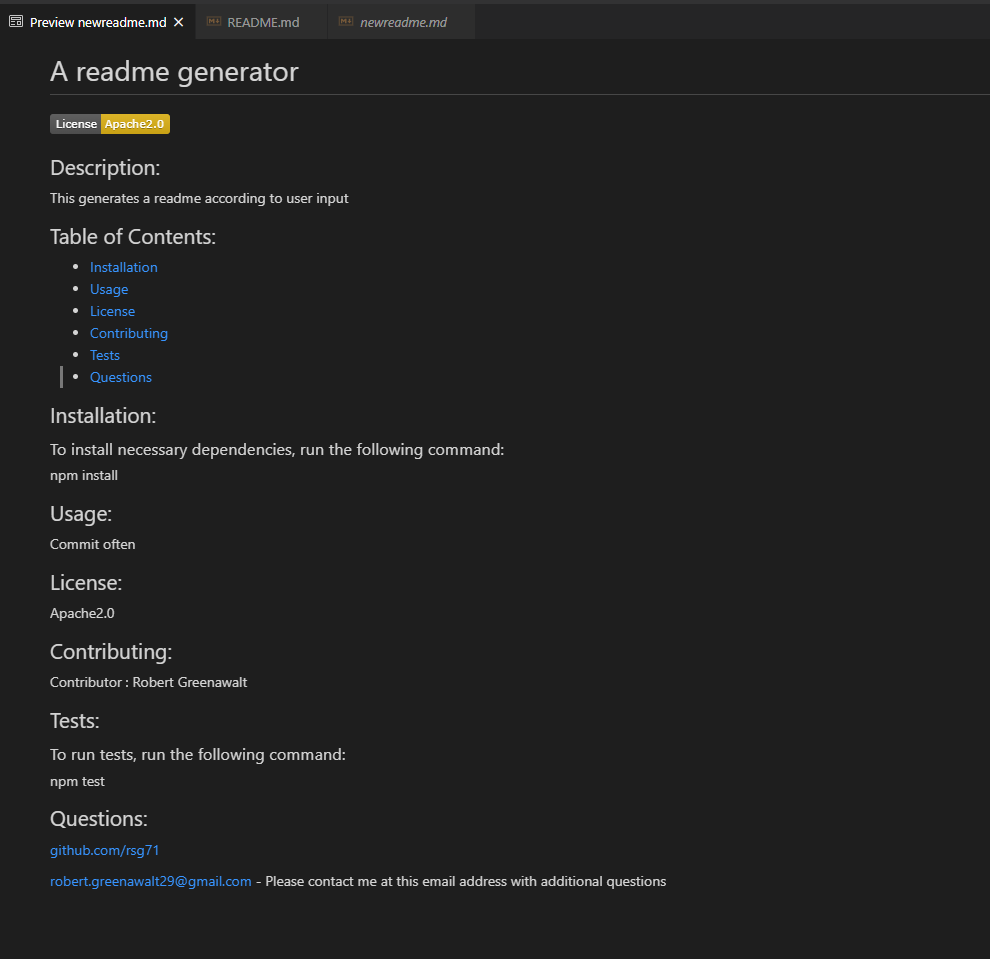

# ReadMe-Generator

## Description

This readme generator will take inputs from the command line in the terminal and automatically produce a readme file for the user. The user is taken through several prompts such as the usage instructions, license choice, a description of the project, etc. and this information is conveniently placed on the newly generated readme.

## Table of Contents

* [Usage](#usage)
* [Credits](#credits)
* [License](#license)

## Usage

**Below is how the readme generator functions**

Sample of a readme generated: 

## Credits
* Robert Greenawalt (https://github.com/rsg71)

## License

MIT License

Copyright (c) 2020 James Lamb

Permission is hereby granted, free of charge, to any person obtaining a copy of this software and associated documentation files (the "Software"), to deal in the Software without restriction, including without limitation the rights to use, copy, modify, merge, publish, distribute, sublicense, and/or sell copies of the Software, and to permit persons to whom the Software is furnished to do so, subject to the following conditions:

The above copyright notice and this permission notice shall be included in all copies or substantial portions of the Software.

THE SOFTWARE IS PROVIDED "AS IS", WITHOUT WARRANTY OF ANY KIND, EXPRESS OR IMPLIED, INCLUDING BUT NOT LIMITED TO THE WARRANTIES OF MERCHANTABILITY, FITNESS FOR A PARTICULAR PURPOSE AND NONINFRINGEMENT. IN NO EVENT SHALL THE AUTHORS OR COPYRIGHT HOLDERS BE LIABLE FOR ANY CLAIM, DAMAGES OR OTHER LIABILITY, WHETHER IN AN ACTION OF CONTRACT, TORT OR OTHERWISE, ARISING FROM, OUT OF OR IN CONNECTION WITH THE SOFTWARE OR THE USE OR OTHER DEALINGS IN THE SOFTWARE.